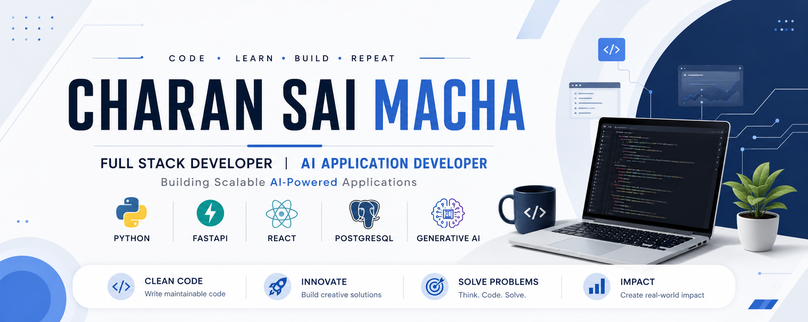

  

  

💻 Full Stack Developer &nbsp; • &nbsp;
🤖 AI Application Developer &nbsp; • &nbsp;
🧠 200+ DSA Problems Solved &nbsp; • &nbsp;
🚀 Open to Opportunities

---

## 👨‍💻 About Me

I'm a passionate **Full Stack Developer** who enjoys building scalable web applications and AI-powered solutions. I love solving real-world problems through clean code, modern technologies, and continuous learning.

- 🔭 Currently building AI-powered Full Stack applications
- 🌱 Learning System Design, Cloud, and Generative AI
- 💼 Interested in Software Engineering & AI roles
- 🧠 Solved 200+ Data Structures & Algorithms problems
- 🚀 Passionate about scalable backend systems and REST APIs
- ⚡ Love turning ideas into real-world products
---

## 🚀 Current Focus

- 🧠 Building AI-powered Full Stack Projects
- ⚡ Strengthening Data Structures & Algorithms
- ☁️ Learning Cloud & System Design
- 🤖 Exploring Large Language Models (LLMs)
  
## 🛠️ Technical Skills

### Languages

  

### Frontend Development

  

**React.js • Next.js • JavaScript • HTML5 • CSS3 • Tailwind CSS**

### Backend Development

  

**FastAPI • Django • Flask • Node.js • Express.js • REST APIs • JWT Authentication**

### Databases

  

**PostgreSQL • MongoDB • MySQL • SQLAlchemy • Prisma**

### AI & Machine Learning

  

**Scikit-learn • YOLOv8 • XGBoost • Gemini API • Pandas • NumPy • Generative AI**

### Tools & Deployment

  

**Git • GitHub • VS Code • Postman • Vercel • Render • Neon**

---

## 🚀 Featured Projects

### 🧠 ResumeIQ — AI Resume Analyzer

> **An AI-powered platform that helps job seekers optimize their resumes for ATS systems and interview preparation.**

### ✨ Features

- 📄 Resume Parsing
- 🎯 ATS Score Analysis
- 🤝 Job Match Analysis
- 📋 Resume Summary
- 💌 AI Cover Letter Generation
- 🎤 AI Interview Questions
- 🔐 JWT Authentication

### 🛠️ Tech Stack

`React` `FastAPI` `PostgreSQL` `SQLAlchemy` `Gemini AI` `JWT`

---

### 🚘 Car Price Prediction

> **A machine learning application that predicts vehicle prices using historical data and exposes predictions through a FastAPI backend with a React frontend.**

### ✨ Features

- 📈 Price Prediction
- ⚡ FastAPI REST API
- 🌐 React Frontend
- 🤖 Machine Learning Model
- 🚀 Deployment Ready

### 🛠️ Tech Stack

`Python` `XGBoost` `FastAPI` `React`

---

### 🚗 AI Vehicle Damage Detection & Repair Cost Estimator

> **An AI-powered web application that detects vehicle damage from images and estimates repair costs using deep learning.**

### ✨ Features

- 📷 Upload Vehicle Images
- 🤖 YOLOv8 Damage Detection
- 💰 Repair Cost Estimation
- 📊 Damage Analysis
- 🌐 Flask Web Application

### 🛠️ Tech Stack

`Python` `YOLOv8` `Flask` `MySQL`

---

## 🧩 Problem Solving

### 200+ DSA Problems Solved

Consistently practicing **Data Structures & Algorithms** and strengthening problem-solving skills through coding challenges.

🏆 **50 Days LeetCode Badge**

---

## 🎓 Certifications

* **Python for Data Science** — IBM
* **Data Analytics Job Simulation** — Deloitte
* **Java Advanced** — Oracle

---

## 🤝 Connect With Me

 

### 💡 Build. Learn. Improve. Repeat.

Thanks for visiting my profile! ⭐

